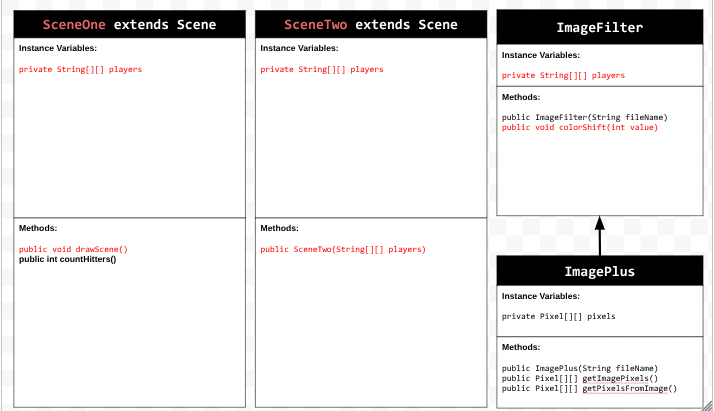
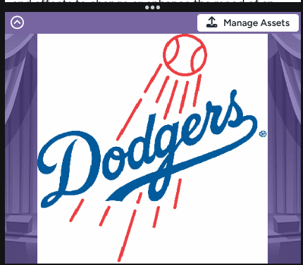

# Unit 5 - Personal Narrative / Interest Animation

## Introduction

Images are often used to portray our personal experiences and interests. We also use image filters and effects to change or enhance the mood of an image. When combined into collages and presentations, these images tell a story about who we are and what is important to us. Your goal is to create an animation using The Theater and Scene API that consists of images of your personal experiences and/or interests. In this animation, you will incorporate data related to these experiences and/or interests that can be organized in a 2D array, and use image filters and effects to change or enhance the mood of your images.
## Requirements

Use your knowledge of object-oriented programming, two-dimensional (2D) arrays, and algorithms to create your personal narrative collage or animation:
- **Write Scene subclasses** – Create two Scene subclasses: either two core parts of your personal life, or two components of a personal interest. Each class must contain a constructor and private instance variable with data related to the scene
- **Create at least two 2D arrays** – Create at least two 2D arrays to store the data that will make up your visualization.
Implement algorithms – Implement one or more algorithms that use loops and logic that operate on the data in your 2D arrays.
- **Create a visualization** – Create an animation that conveys the story of the data by illustrating the patterns or relationships in the data.
- **Image Filters** – Utilize the image filters created in this unit (and possible new filters) that show a personal flare to the images used in your animation.
- **Document your code** – Use comments to explain the purpose of the methods and code segments and note any preconditions and postconditions.

## UML Diagram

Put an image of your UML Diagram here. Upload the image of your UML Diagram to your repository, then use the Markdown syntax to insert your image here. Make sure your image file name is one work, otherwise it might not properly get displayed on this README.

## Video

Record a short video of your story to display here on your README. You can do this by:

- Screen record your project running on Code.org.
- Upload that recording to YouTube.
- Take a thumbnail for your image.
- Upload the thumbnail image to your repo.
- Use the following markdown

## Story Description

Write a description of the story that your animation showcases. Give additional context for your story here in the case your animation is more abstract and only has images and little text. Lastly, include what data in your project is represented in 2D arrays and how those directly relate to the story your animation showcases.

In this animation, it starts off by going through dodger hitters and using a filter on them whilst playing a sound. After that it shows dodger pitchers and then uses a filter on them.The data stored in the 2D arrays is the player nicknames which is displayed after the image is filtered.

## Image Filter Analysis

Choose at least 2 filters used in your animation to explain how the pixels are modified. If you created a new image filter that was not one of the ones from this unit, make sure to explain and analyze that filter(s) before choosing ones that came from this unit.

There is a colorShift filter that shifts the pixels colors by the amount the user inputs and changes it for example if the colors was 200, 200, 200 and you added 50, it would become 250, 250, 250. If you added 100 and it went over 255, it would set it back down to 255 because that is the limit for colors. Another image filter is the motion blur which uses the inputted direction and it moves the columns to the right and things like that so it will look like it blurred. 